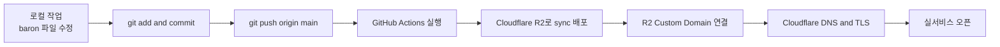

# Baron Cloudflare R2 배포 가이드

## 목표

- `c:\laragon\www\baron` 디렉토리의 정적 파일을 Git 기반으로 관리한다.
- 로컬 작업 후 커밋하고, GitHub 원격 저장소로 push 하면 CI/CD가 자동 실행되도록 구성한다.
- GitHub Actions가 Cloudflare R2 버킷으로 파일을 배포하도록 설정한다.
- Cloudflare에서 커스텀 도메인과 DNS를 연결해 실제 서비스까지 완료한다.

## 운영 전제

- 형상관리는 필수이며, GitHub를 단일 기준 저장소로 사용한다.
- 작업 흐름은 `로컬 작업 -> GitHub push -> Cloudflare R2 배포`로 고정한다.
- 수정이 필요할 때는 `GitHub pull -> 로컬 작업 -> GitHub push -> Cloudflare R2 재배포` 흐름으로 운영한다.
- 최종 검토는 현재 팀에서 진행한다.
- 실제 사이트 유지보수와 상시 수정은 디자인팀이 담당하는 것을 전제로 한다.
- 따라서 배포 절차는 개발자가 아니어도 반복 가능한 방식이어야 한다.

## 저장소 기준

- 1차 기준 저장소는 `GitHub`로 한다.
- CI/CD도 `GitHub Actions` 기준으로 구성한다.
- `Gitea`는 나중에 필요할 때 별도 대안으로 검토한다.
- 즉, 현재 문서의 `git push` 대상은 기본적으로 `GitHub origin`이다.

## 최종 배포 흐름



## 실제 운영 흐름

### 신규 반영

1. 로컬에서 파일 수정
2. 로컬 브라우저에서 확인
3. Git 커밋
4. GitHub `main` 브랜치로 push
5. GitHub Actions 자동 실행
6. Cloudflare R2 버킷으로 자동 배포
7. 운영 URL 최종 확인

### 수정 반영

1. GitHub 최신 내용 pull
2. 로컬에서 수정 작업
3. 로컬 브라우저 확인
4. Git 커밋
5. GitHub `main` 브랜치로 push
6. GitHub Actions 자동 실행
7. Cloudflare R2 버킷으로 자동 재배포
8. 운영 URL 최종 확인

## 권장 구조

이 가이드는 아래 구조를 기준으로 작성한다.

```text
레포 루트 = c:\laragon\www\baron
```

즉, Git 저장소 루트 안에 아래 같은 구조가 있다고 가정한다.

- `assets/`
- `ko/`
- `en/`
- `_include/`
- `.github/workflows/`

배포 시에는 `baron` 폴더 자체가 사이트 루트가 되어야 한다.

예를 들어 R2에 올라간 오브젝트 키는 아래처럼 되어야 한다.

- `assets/css/layout.css`
- `assets/js/common.js`
- `ko/index.html`
- `ko/dx.html`
- `en/index.html`
- `_include/header.html`

중요:

- `c:\laragon\www` 전체를 올리면 안 된다.
- `baron` 내부 내용만 사이트 루트로 올라가야 한다.

## 배포 방식 선택

### 1. R2 퍼블릭 버킷만 사용하는 방식

장점:

- 구조가 단순하다.
- 정적 파일 배포가 빠르다.
- 현재 Baron 구조와 바로 연결하기 쉽다.

주의점:

- `/`가 자동으로 `/index.html`로 연결되지 않을 수 있다.
- `/ko/`, `/en/` 같은 폴더 경로도 자동 인덱스 처리되지 않을 수 있다.

### 2. R2 + Worker를 함께 사용하는 방식

장점:

- `/` -> `/ko/index.html` 같은 라우팅 제어가 가능하다.
- 향후 리다이렉트, 404 처리, 언어 분기, 예쁜 URL 대응이 쉽다.

현재 Baron 기준 추천:

- 1차 배포는 `R2 + 커스텀 도메인`으로 구성한다.
- 필요하면 2차로 Worker를 붙여 `/`, `/ko/`, `/en/` 라우팅을 정리한다.

## 사전 준비

필수 준비물:

- Cloudflare 계정
- Cloudflare에 등록된 운영 도메인 Zone
- 같은 Cloudflare 계정 안에서 사용할 R2 권한
- GitHub 원격 저장소
- 배포용 브랜치 정책
  - 예: `main` push 시 운영 배포

로컬에서 사전 점검할 파일:

- `ko/index.html`
- `en/index.html`
- `ko/dx.html`
- `ko/tova/value.html`
- `assets/css/layout.css`
- `assets/js/common.js`
- `assets/js/dx.js`

## 1단계: Git 저장소 준비

이미 Git 저장소가 없다면 `baron` 폴더를 GitHub 연동 기준 저장소로 초기화한다.

```powershell
Set-Location "c:\laragon\www\baron"
git init
git branch -M main
git remote add origin <GitHub_원격저장소_URL>
```

첫 커밋 예시:

```powershell
git add .
git commit -m "chore: initialize baron site repository"
git push -u origin main
```

권장 브랜치 전략:

- `main`: 운영 배포 브랜치
- `feature/*`: 작업 브랜치
- 운영 반영은 `main`으로 merge 후 push

## 2단계: Cloudflare R2 버킷 생성

Cloudflare 대시보드에서:

1. `R2 Object Storage`로 이동
2. `Create bucket` 선택
3. 버킷명 입력
   - 예: `baron-prod`
4. 필요 시 Location Hint 선택
5. 버킷 생성

권장 버킷명:

- 운영: `baron-prod`
- 스테이징: `baron-stg`

## 3단계: R2 배포용 API 자격증명 생성

GitHub Actions에서 업로드하려면 R2 S3 호환 자격증명이 필요하다.

Cloudflare에서 생성할 값:

- Account ID
- R2 Access Key ID
- R2 Secret Access Key

권한은 최소 아래를 포함하면 된다.

- `Object Read`
- `Object Write`

중요:

- `aws s3 sync`는 업로드 전에 대상 버킷을 조회하기 때문에 `ListObjectsV2`가 가능해야 한다.
- 즉, 실제 배포 키는 업로드만 가능한 쓰기 전용 키로는 부족할 수 있다.
- GitHub Actions에서 `AccessDenied`가 발생하면 먼저 `CF_R2_ACCOUNT_ID`가 해당 버킷의 실제 Cloudflare Account ID와 같은지 확인한다.
- 그 다음 `CF_R2_ACCESS_KEY_ID`와 `CF_R2_SECRET_ACCESS_KEY`가 같은 계정에서 발급된 R2 자격증명인지 확인한다.
- 마지막으로 그 키가 배포 대상 버킷에 대해 목록 조회와 업로드가 가능한 권한 범위로 생성되었는지 확인한다.

R2 S3 endpoint 형식:

```text
https://<ACCOUNT_ID>.r2.cloudflarestorage.com
```

## 4단계: GitHub Secrets 등록

GitHub 저장소의 `Settings -> Secrets and variables -> Actions`에 아래 값을 등록한다.

필수 Secrets:

- `CF_R2_ACCOUNT_ID`
- `CF_R2_ACCESS_KEY_ID`
- `CF_R2_SECRET_ACCESS_KEY`
- `CF_R2_BUCKET`

선택 Secrets:

- `CF_ZONE_ID`
- `CF_API_TOKEN`

선택값은 배포 후 캐시 purge 또는 API 자동화를 할 때 사용한다.

## 5단계: GitHub Actions CI/CD 구성

이 저장소에 아래 워크플로 파일을 둔다.

- `.github/workflows/deploy-r2.yml`

배포 개념:

- `main` 브랜치로 push
- GitHub Actions 실행
- Baron 정적 파일을 R2 버킷에 sync
- 필요 시 오래된 파일 삭제

중요:

- 현재 배포 파이프라인은 `GitHub` 기준이다.
- Gitea Actions나 자체 Runner 기준 문서는 이 가이드 범위에 포함하지 않는다.

이 저장소에는 실제 예시 워크플로 파일도 함께 추가한다.

## 6단계: 배포 제외 파일 원칙

R2에는 사이트 운영에 필요한 파일만 올라가야 한다.

배포 제외 권장 대상:

- `.git/*`
- `.github/*`
- `*.md`
- 로컬 테스트용 임시 파일
- 에디터 설정 파일

즉, 문서와 CI 설정은 Git에는 올라가지만 R2에는 올라가지 않게 구성한다.

## 7단계: 로컬에서 배포 흐름

실제 작업 순서:

1. 로컬에서 Baron 파일 수정
2. 브라우저로 로컬 검증
3. Git 커밋
4. `main` 브랜치에 push
5. GitHub Actions 자동 배포
6. Cloudflare R2 반영 확인
7. 서비스 URL 최종 점검

예시:

```powershell
Set-Location "c:\laragon\www\baron"
git checkout main
git pull origin main

git add .
git commit -m "fix: update baron production assets"
git push origin main
```

디자인팀 유지보수 기준 운영 원칙:

- 반드시 GitHub에서 최신 내용을 pull 받은 후 작업한다.
- 반드시 로컬에서 수정 후 push 한다.
- GitHub에 없는 파일을 서버에서 직접 수정하지 않는다.
- 운영 반영 이력은 모두 Git 커밋으로 남긴다.
- Cloudflare R2는 배포 대상이지, 원본 관리 저장소가 아니다.

## 8단계: Cloudflare R2 커스텀 도메인 연결

도메인은 R2 버킷과 같은 Cloudflare 계정 안에 Zone으로 등록되어 있어야 한다.

Cloudflare 대시보드에서:

1. `R2 Object Storage` 열기
2. 버킷 선택
3. `Settings` 이동
4. `Custom Domains`에서 `Add`
5. 연결할 호스트명 입력
   - 예: `www.example.com`
6. 생성될 DNS 레코드 확인
7. `Connect Domain` 선택

정상 상태:

- `Initializing`
- 잠시 후 `Active`

문제가 있을 때 확인할 것:

- 같은 계정의 Zone인지
- 기존 충돌 DNS 레코드가 없는지
- Zone hold 이슈가 없는지

## 9단계: DNS 구성

### 권장 구성

#### 운영 사이트 호스트

- `www.example.com` -> R2 Custom Domain 연결

이 레코드는 일반적으로 R2 커스텀 도메인 연결 과정에서 Cloudflare가 자동 생성한다.

#### 루트 도메인 처리

권장 방식:

- `example.com/*` -> `https://www.example.com/$1` 리다이렉트

그리고 홈페이지 진입을 명확히 하려면 추가 리다이렉트를 둔다.

- `https://www.example.com/` -> `https://www.example.com/ko/index.html`

### 서브도메인 테스트 환경 예시

- `baron.example.com` -> R2 커스텀 도메인

내부 검증용이라면 이 방식이 단순하다.

## 10단계: SSL/TLS 점검

커스텀 도메인 연결 후:

1. Cloudflare Zone의 `SSL/TLS` 확인
2. 접속 주소가 `https`로 열리는지 확인
3. 인증서 경고가 없는지 확인

참고:

- 일반적인 1단계 서브도메인 `www.example.com`은 Universal SSL로 처리되는 경우가 많다.
- 더 깊은 서브도메인은 별도 검토가 필요할 수 있다.

## 11단계: 캐시 운영 원칙

R2 커스텀 도메인은 Cloudflare 캐시를 사용할 수 있다.

권장 캐시 정책:

### HTML

- 짧은 캐시 또는 보수적 캐시
- 긴급 수정 후 바로 반영되어야 함

### CSS / JS / 이미지 / 폰트

- 긴 캐시 사용 가능
- 파일명 변경 또는 query version으로 갱신 관리

권장 Cloudflare 설정:

- Smart Tiered Cache 사용 가능 시 활성화
- `/assets/*` 대상 캐시 규칙 추가
- 이미지 파일 적극 캐시

## 12단계: R2 단독 운영 시 주의할 점

R2는 일반 웹호스팅처럼 자동 문서 인덱스를 항상 보장하지 않는다.

즉, 아래 URL은 바로 잘 동작할 수 있다.

- `/ko/index.html`
- `/en/index.html`
- `/ko/tova/value.html`

하지만 아래 URL은 추가 처리 없이는 기대와 다를 수 있다.

- `/`
- `/ko/`
- `/en/`

따라서 Baron 운영 시 권장 방식은 아래 둘 중 하나다.

### 방식 A: 명시적 HTML 경로 사용

- `https://www.example.com/ko/index.html`
- `https://www.example.com/en/index.html`

### 방식 B: 리다이렉트 또는 Worker 추가

예:

- `/` -> `/ko/index.html`
- `/ko/` -> `/ko/index.html`
- `/en/` -> `/en/index.html`

## 13단계: 권장 검증 체크리스트

배포 후 아래를 확인한다.

1. `https://www.example.com/ko/index.html` 정상 접속
2. `https://www.example.com/en/index.html` 정상 접속
3. `https://www.example.com/ko/dx.html` 이미지 정상 로드
4. CSS, JS, 이미지 경로 `404` 없음
5. 헤더/풋터 include 관련 경로 정상 동작
6. 콘솔 에러에 정적 자산 누락이 없음
7. R2 Custom Domain 상태가 `Active`
8. SSL 인증서 경고 없음
9. 필요 없으면 `r2.dev` public URL 비활성화

## 14단계: 운영 배포 절차 요약

### 최초 1회 설정

1. `baron` 폴더를 Git 저장소로 구성
2. GitHub 원격 저장소 연결
3. Cloudflare R2 버킷 생성
4. R2 API 자격증명 생성
5. GitHub Secrets 등록
6. GitHub Actions 워크플로 추가
7. R2 커스텀 도메인 연결
8. DNS 및 HTTPS 검증

### 이후 상시 배포

1. GitHub 최신 내용 pull
2. 로컬 수정
3. 로컬 브라우저 검증
4. Git 커밋
5. `main` push
6. GitHub Actions 자동 배포
7. 운영 URL 점검

## 15단계: GitHub Actions 실제 배포 예시

아래 워크플로는 이 저장소에 포함하는 기준 예시다.

동작 방식:

- `main` 브랜치 push 시 실행
- GitHub runner에서 AWS CLI로 R2에 sync
- 사이트와 무관한 파일은 제외

배포 대상 기준:

- 저장소 루트가 `baron`이라고 가정

## 16단계: 장애 유형과 대응

### 1. 버킷 안에 `baron/` 폴더째 올라감

원인:

- 업로드 루트가 잘못됨

해결:

- `baron` 폴더 내부가 오브젝트 루트가 되도록 sync

### 2. `/` 접속 시 홈페이지가 열리지 않음

원인:

- R2는 자동 인덱스 문서 처리 보장이 약함

해결:

- Redirect Rule 또는 Worker 추가

### 3. 이미지나 JS가 404

원인:

- 잘못된 상대경로
- 잘못된 업로드 루트

해결:

- 오브젝트 키가 `assets/...`로 올라갔는지 확인
- 코드 경로가 `/baron` 없이 사이트 루트 기준으로 맞는지 확인

### 4. 배포 후 변경사항이 안 보임

원인:

- Cloudflare 캐시 또는 브라우저 캐시

해결:

- 캐시 purge
- HTML은 짧은 캐시
- CSS/JS는 버전 관리

### 5. 도메인 상태가 `Initializing`에서 멈춤

원인:

- DNS 충돌
- 다른 계정 Zone
- Zone hold

해결:

- 충돌 레코드 정리
- 같은 계정인지 확인
- 재시도

## 17단계: 권장 최종 운영 형태

가장 실용적인 Baron 운영 구성:

1. `baron` 폴더를 Git 저장소로 관리한다.
2. GitHub를 형상관리의 단일 기준 저장소로 사용한다.
3. 디자인팀은 GitHub에서 최신 내용을 pull 받은 뒤 로컬에서 작업한다.
4. 작업 완료 후 GitHub `main` 브랜치로 push 한다.
5. `main` push 시 GitHub Actions가 자동 실행된다.
6. GitHub Actions가 R2 `baron-prod` 버킷으로 sync 배포한다.
7. `www.example.com`을 R2 커스텀 도메인으로 연결한다.
8. `example.com`은 `www.example.com`으로 리다이렉트한다.
9. `/`는 `/ko/index.html`로 리다이렉트한다.
10. 정적 자산은 캐시를 적극 사용한다.

## 한 줄 운영 원칙

원본은 GitHub, 작업은 로컬, 배포 대상은 Cloudflare R2로 고정한다.

## 18단계: 추가 확장 권장 사항

추가로 고려하면 좋은 것:

- Worker로 `/`, `/ko/`, `/en/` 라우팅 정리
- 스테이징 버킷 별도 구성
- 배포 후 Cloudflare Cache Purge 자동화
- GitHub Actions에서 배포 전 HTML 링크 검사 추가
- 운영 브랜치 보호 규칙 설정